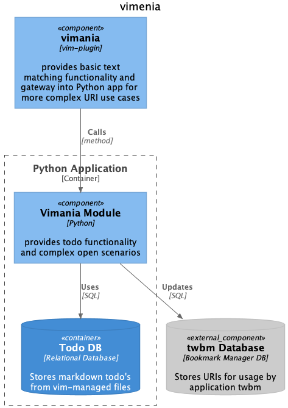

# vimania-uri

- VIM needs to find vimania dependencies in `pythonx`.
- vim interface cannot be tested within PyCharm, needs to be called from VIM.
- For python changes it is important to restart vim after every change in order to enforce proper reload:
  this is best automated with a Vader script: `run_tests.sh testfile` in tests directory.
- vimscript changes can be reloaded as usual
- `buku.py` needs to be copied from `twbm` package as it is used to push URLs to buku DB.
- global python version must match Pipfile version for development instllation to work (pythonx)

## Testing
- `Vader` tests require libs in `pythonx`.
```bash
#### Python: pytest
make test

#### VIM: Vader
make build-vim  # install libs in pythonx
make test-vim-uri
```

### Architecture

